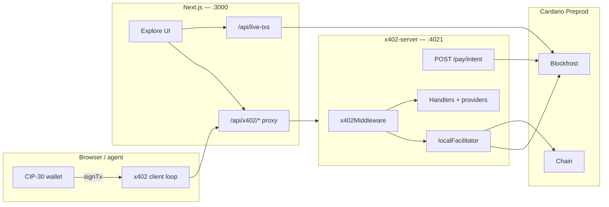

# Finality — Cardano x402 Market Intelligence

Pay-per-call HTTP APIs for market data, AI analysis, and **Cardano on-chain reads**. Humans use **CIP-30** (Lace / Nami on Preprod). Agents use the same catalog with their own signer. Every paid call settles in **lovelace (ADA)** on **Cardano Preprod** via the **x402** protocol (`@odatano/x402`).

No subscriptions. No API keys for payment. No custodial keys in the app.

## What you get

| Area | Examples |
|------|----------|
| Market | Quotes, candles, trending, fear & greed |
| Intelligence | Signals, technicals, reports, backtests |
| Agents / AI | Decisions, briefings, strategy parse, chat |
| Cardano | Address, portfolio, asset, tip, health (Blockfrost) |

Catalog and prices: `GET /v1/catalog` on the merchant.

## Architecture



**Request path (paid call)**

1. Unpaid `GET/POST /v1/...` → **HTTP 402** + base64 **`PAYMENT-REQUIRED`** (`cardano:preprod`, asset `lovelace`, exact amount, `payTo`).
2. Browser: `POST /pay/intent` with buyer bech32 + requirement → unsigned tx CBOR.
3. Wallet signs via CIP-30; client retries with **`PAYMENT-SIGNATURE`**.
4. Merchant **`localFacilitator`** verifies and submits settlement through **`@odatano/core`** + **Blockfrost**.
5. Handler runs; response includes JSON envelope + **`PAYMENT-RESPONSE`** receipt.

See [docs/architecture.md](docs/architecture.md) for module layout, env vars, and deployment notes.

## Repository layout

```text
app/                    Next.js — landing, Explore dashboard, API routes
  api/x402/[...path]/   Same-origin proxy to merchant (preserves x402 headers)
  api/live-txs/         Blockfrost feed for payTo address (live table)
  explore/              Run, endpoints, transactions, live, settings
lib/
  cardano/              CIP-30 connector, network config
  x402/                 Browser paid-fetch (x402Fetch + /pay/intent)
  providers/            Market + mock fallbacks
  dashboard/            Catalog labels, local tx history (browser)
x402-server/            Cardano x402 resource server (Express)
  index.ts              CORS, public routes, middleware, handlers
  registry.ts           Endpoint catalog + lovelace prices
  handlers.ts           Provider calls + response envelope
x402/                   Vendored @odatano/x402 (srv client, middleware, tests)
```

## Stack

| Layer | Technology |
|-------|------------|
| UI | Next.js, React, Tailwind |
| Merchant | Express, `@odatano/x402`, `@odatano/core` |
| Payment network | Cardano Preprod (`cardano:preprod`) |
| Asset | `lovelace` (ADA) |
| Indexer | Blockfrost (`NETWORK=preprod`) |
| Wallets | Lace, Nami (CIP-30, `networkId = 0`) |
| Settlement | In-process `localFacilitator` (leave `X402_FACILITATOR_URL` empty) |

## Quick start

```bash
cp .env.example .env.local
cp .env.example x402-server/.env
```

Set in **both** `.env.local` and `x402-server/.env`:

- `BLOCKFROST_API_KEY` — Preprod project key from [blockfrost.io](https://blockfrost.io)
- `X402_PAYTO_ADDRESS` — your Preprod receive address (`addr_test1…`)
- `NEXT_PUBLIC_X402_PAYTO` — same address (browser display)

Leave `X402_FACILITATOR_URL` **empty** for in-process Cardano settlement.

```bash
npm install
npm run dev:all          # merchant :4021 + Next :3000
```

Or run separately:

```bash
npm run dev:merchant     # Cardano x402 merchant
npm run dev              # Next.js UI only
```

| Surface | URL |
|---------|-----|
| Production | https://finality-cardano.vercel.app |
| Landing (local) | http://localhost:3000 |
| Explore | http://localhost:3000/explore · https://finality-cardano.vercel.app/explore |
| Run (paid calls) | http://localhost:3000/explore/run |
| Live on-chain hits | http://localhost:3000/explore/live |
| Merchant (Render) | https://x402-server-w7qy.onrender.com |
| Merchant health | https://x402-server-w7qy.onrender.com/health |
| Catalog | https://x402-server-w7qy.onrender.com/v1/catalog |
| Proxied catalog | http://localhost:3000/api/x402/v1/catalog |

Verify Cardano 402 shape:

```bash
npm run check:discovery
```

## Environment (Cardano)

| Variable | Purpose |
|----------|---------|
| `X402_PAYTO_ADDRESS` | Merchant receive address (Preprod) |
| `X402_NETWORK` | `cardano:preprod` |
| `X402_ASSET` | `lovelace` |
| `X402_FACILITATOR_URL` | Empty → `localFacilitator` |
| `BLOCKFROST_API_KEY` | Tx build, verify, settle, on-chain routes |
| `NETWORK` / `BACKENDS` | `preprod` / `blockfrost` |
| `X402_SERVER_URL` | Next proxy target (`https://x402-server-w7qy.onrender.com`) |
| `NEXT_PUBLIC_X402_*` | Public network + payTo for UI |

Full list: [.env.example](.env.example).

## Pricing

Each route has a fixed **USDM** price in the registry (catalog shows two decimal places, **0.01–0.10 USDM** per call). Settlement uses the matching atomic USDM units on Cardano.

## Security

- The UI **never** accepts mnemonics or private keys.
- Browser signing only through **CIP-30**.
- Settlement evidence is **x402** payment headers only — not custom “proof” strings.
- **Cardano only** — no alternate L1 payment rails in this product.

## Scripts

| Command | Description |
|---------|-------------|
| `npm run dev` | Next.js dev server |
| `npm run dev:merchant` | Cardano merchant on port 4021 |
| `npm run dev:all` | Merchant + frontend |
| `npm run build` | Production Next build |
| `npm run test` | Vitest |
| `npm run check:discovery` | Assert 402 offers `cardano:preprod` + `lovelace` |

## Documentation

- [Architecture](docs/architecture.md) — components, flows, deployment
- [Product guide](docs/final-product.md) — user and agent journeys
- [API endpoints](docs/api-endpoints.md) — routes and prices
- [Implementation contract](docs/final_implementation.md) — rules for contributors
- [CIP-30 wallet](lib/cardano/README.md) — Lace / Nami integration
- [x402 protocol (vendored)](x402/docs/protocol.md) — payment scheme details

## Cardano resources

- [Cardano x402 overview](https://developers.cardano.org/x402/)
- [CIP-30](https://github.com/cardano-foundation/CIPs/tree/master/CIP-0030) — dApp ↔ wallet API
- [Blockfrost](https://blockfrost.io) — Preprod indexer
- [Cardanoscan Preprod](https://preprod.cardanoscan.io) — explorer
