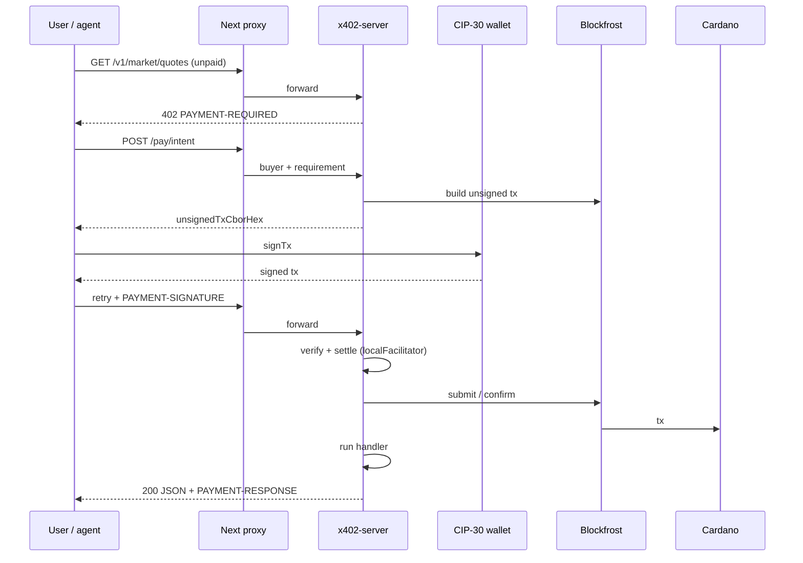

# Finality architecture (Cardano)

Finality is a **Cardano-native x402 merchant** with a **Next.js Explore UI**. Payment rail: **Preprod** (`cardano:preprod`), asset **`lovelace`**. Protocol: **x402 v2 exact scheme** via vendored **`@odatano/x402`** (`x402/srv/`).

## System context

```text
┌─────────────────────────────────────────────────────────────────┐
│                        Cardano Preprod L1                        │
│   UTxOs · lovelace · Blockfrost (read + submit + confirm)        │
└────────────────────────────▲────────────────────────────────────┘
                             │
              ┌──────────────┴──────────────┐
              │   x402-server (merchant)     │
              │   localFacilitator           │
              │   verify → settle → handler  │
              └──────────────▲──────────────┘
                             │ HTTP (402, pay/intent, /v1/*)
              ┌──────────────┴──────────────┐
              │   Next.js                    │
              │   /api/x402/* proxy          │
              │   Explore + CIP-30           │
              └──────────────▲──────────────┘
                             │
                    Browser / HTTP agent
                    (Lace · Nami · own signer)
```

## Components

### Next.js (`app/`)

| Piece | Role |
|-------|------|
| Landing + marketing | Cardano x402 positioning, no subscription model |
| `app/explore/*` | Dashboard: catalog, Run, browser tx history, **live Blockfrost table**, settings |
| `app/api/x402/[...path]/route.ts` | Reverse proxy to `X402_SERVER_URL`; forwards `PAYMENT-*` headers |
| `app/api/live-txs/route.ts` | Server-side Blockfrost poll of `X402_PAYTO_ADDRESS` for live settlement table |

The UI does **not** settle payments itself. It uses `lib/x402/client.ts` → `x402Fetch` + `POST /api/x402/pay/intent` (proxied to merchant).

### CIP-30 layer (`lib/cardano/`)

- Discovers **Lace** and **Nami** on Preprod (`networkId = 0`).
- Exposes connect, balance, `signTx(unsignedCborHex)`.
- Session state in React context; no key material stored.

### x402 browser client (`lib/x402/`)

1. Request paid URL (via proxy).
2. On 402, parse `PAYMENT-REQUIRED`.
3. Call merchant `/pay/intent` with buyer bech32 + requirement.
4. Sign returned unsigned tx with CIP-30.
5. Retry with payment signature; read `PAYMENT-RESPONSE`.

Deep-imports from `x402/srv/client/*` so Next does not bundle Express server middleware.

### Merchant (`x402-server/`)

Express app — single process, port **`X402_SERVER_PORT`** (default **4021**).

| Route | Auth | Purpose |
|-------|------|---------|
| `GET /health` | Public | Liveness, network, facilitator mode |
| `GET /info` | Public | `payTo`, network, asset |
| `GET /v1/catalog` | Public | Discovery metadata + ADA prices |
| `GET /v1/openapi.json` | Public | OpenAPI stub |
| `POST /pay/intent` | Public | Build unsigned lovelace payment tx |
| `GET/POST /v1/*` | **x402** | Paid resources |

**Payment gate:** `x402Middleware` from `x402/srv/middleware/express.ts`

- `payTo`, `network`, `asset` from env
- `routePricing` reads **`registry.ts`** per path/method
- `facilitator`: **`localFacilitator()`** when `X402_FACILITATOR_URL` is empty

**Handlers:** `handlers.ts` calls `lib/providers/*` (Binance, Alternative.me, Blockfrost, mocks). Returns unified JSON envelope with `payment.network`, `payment.asset`, `payment.settlementId`.

**Registry:** `registry.ts` is the single source of truth for operation IDs, paths, methods, and lovelace amounts.

### Vendored x402 (`x402/`)

| Module | Cardano touch? |
|--------|----------------|
| `srv/core/` | Types, requirement parsing (pure) |
| `srv/middleware/` | 402 issue, verify flow, Express/CAP gates |
| `srv/facilitator/` | `localFacilitator`, optional `httpFacilitator` |
| `srv/helpers/` | `buildUnsignedPaymentTx`, address parsing |
| `srv/client/` | `x402Fetch`, errors |
| `srv/bridge.ts` | `@odatano/core` → Blockfrost |

Finality **does not** run a separate facilitator service. Default: one **`localFacilitator`** per merchant process with Blockfrost configured via env.

## Payment sequence



## Data planes

| Plane | Source | Used for |
|-------|--------|----------|
| Payment | Cardano + Blockfrost | x402 only |
| Market | Binance public REST, CoinGecko (optional keys) | Quotes, candles, trending |
| Sentiment | Alternative.me | Fear & greed |
| On-chain | Blockfrost REST | Address, asset, tip, health |
| AI | Groq / Gemini / Ollama (optional) | Intelligence + chat routes |

When upstream fails and `ALLOW_MOCK_FALLBACK=true`, handlers return schema-valid **synthetic** data with `meta.synthetic: true`.

## Local vs production

| Concern | Local dev | Production pattern |
|---------|-----------|-------------------|
| UI | `localhost:3000` | Vercel / static+server Next |
| Merchant | `127.0.0.1:4021` | Container (Render, Fly, etc.) |
| Proxy | `X402_SERVER_URL=http://127.0.0.1:4021` | Internal URL or public merchant host |
| Chain | Preprod | Preprod until explicit mainnet decision |
| Secrets | `.env.local`, `x402-server/.env` | Host env / secret manager |

Deploy merchant and UI as **separate services**. The UI only needs public `NEXT_PUBLIC_X402_*` and proxy target; merchant needs **Blockfrost** + **payTo**.

## Scaling

- **Merchant:** horizontally scalable stateless replicas; settlement idempotency via facilitator claim store (in-process per instance unless shared store configured).
- **Blockfrost:** rate limits → cache short-lived market reads; stagger on-chain probes.
- **Catalog:** add rows in `registry.ts` + handler branch — no UI release required for agents using `/v1/catalog`.

## Explicit non-goals

- Non-Cardano payment rails (EVM, Algorand, etc.)
- Hosted third-party facilitator as default (env stays empty)
- Custodial wallet or mnemonic in browser
- Accepting non-x402 payment headers as settlement

## Related docs

- [final_implementation.md](./final_implementation.md) — contributor contract
- [api-endpoints.md](./api-endpoints.md) — route list
- [final-product.md](./final-product.md) — journeys
- [x402/docs/architecture.md](../x402/docs/architecture.md) — library internals
